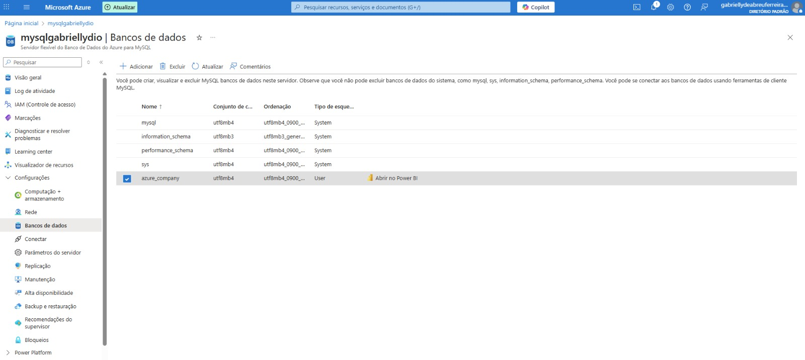

# Projeto: Integração Azure MySQL com Power BI

## Descrição do Projeto
Este projeto teve como objetivo a integração de uma instância MySQL hospedada no **Azure** com o **Power BI**, além da transformação e análise de dados de uma base de dados de exemplo disponível no GitHub.

O desafio envolveu criação de banco, conexão com Power BI e aplicação de boas práticas de ETL para transformar a base em um formato adequado para análises.

---

## Etapas do Projeto

### 1. Criação da instância no Azure
Foi criada uma instância MySQL no Azure para hospedar o banco de dados.



---

### 2. Criação do banco de dados
O banco foi criado com base nos dados disponíveis no repositório do GitHub, contendo tabelas como:
- `employee`
- `departament`
- `dept_locations`
- `project`
- `works_on`
- `dependent`

---

### 3. Integração do Power BI com MySQL no Azure
Foi realizada a conexão do Power BI à instância MySQL no Azure.  
Problemas de SSL foram resolvidos utilizando o certificado **DigiCertGlobalRootCA.crt.pem** e habilitando a opção de conexão SSL.

---

### 4. Transformação de dados

As transformações aplicadas incluíram:

1. **Verificação dos cabeçalhos e tipos de dados**
   - Todos os campos foram revisados e ajustados para o tipo correto.

2. **Valores monetários**
   - A coluna `Salary` da tabela `employee` foi convertida para **Decimal fixo** (tipo double preciso).

3. **Verificação de nulos**
   - Analisados os campos com valores nulos.  
   - O campo `Super_ssn` possui valores nulos para colaboradores que são **gerentes** (ex.: James).

4. **Departamentos sem gerente**
   - Foi verificado que todos os departamentos possuem gerente, portanto nenhuma lacuna foi encontrada.

5. **Número de horas dos projetos**
   - A coluna `Hours` da tabela `works_on` já estava em formato decimal. Mantida como está.

6. **Separação de colunas complexas**
   - A coluna `Address` da tabela `employee` foi separada em:
     - `Number` (número do endereço)
     - `Street` (rua)
     - `City` (cidade)
     - `UF` (estado)
   - Ajustes realizados para cidades com nomes compostos (ex.: `Oak Humble`) e correção de UF.

7. **Mescla de consultas `employee` e `departament`**
   - Criada a tabela **`employee_department`** no Power BI, relacionando colaboradores ao nome do departamento.
   - Tipo de junção utilizada: **Externa esquerda (Left Join)**.

8. **Junção com nomes dos gerentes**
   - Utilizando a tabela `employee_department`, foi possível associar cada colaborador ao nome completo do gerente.
   - Observação: o nome completo incluiu o `Minit` entre nome e sobrenome.

9. **Mescla de colunas Nome e Sobrenome**
   - Criada a coluna `Full Name` unindo `Fname`, `Minit` e `Lname`.

10. **Mescla de departamentos e localização**
    - Criada tabela `dep_location` com combinação única de `Department` e `Location`.
    - Query SQL utilizada no Power BI:

```sql
SELECT 
    d.Dname,
    l.Dlocation,
    CONCAT(d.Dname, ' - ', l.Dlocation) AS Department_Location
FROM dept_locations l
JOIN departament d
    ON l.Dnumber = d.Dnumber;
```

## Tecnologias Utilizadas

- **Azure Database for MySQL** – Hospedagem do banco de dados na nuvem.
- **MySQL** – Sistema de gerenciamento do banco de dados relacional.
- **Power BI** – Conexão com o banco e transformação/análise de dados.
- **SQL** – Criação de consultas para extração e manipulação dos dados.
- **ETL (Extract, Transform, Load)** – Processos de limpeza, transformação e modelagem de dados no Power BI.

